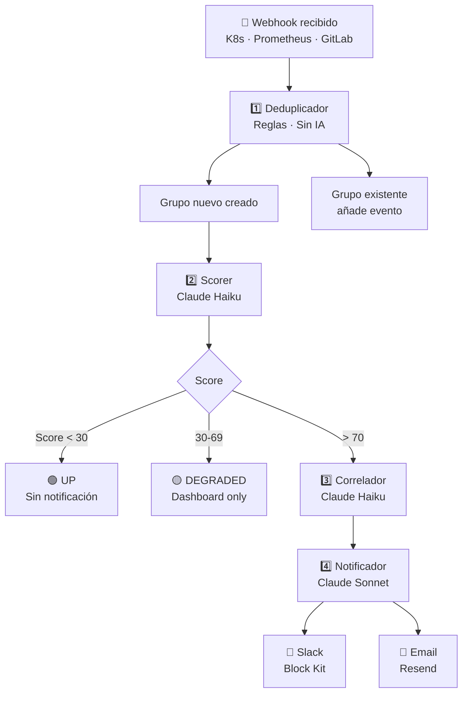

# Pipeline de IA

centinelAI usa un pipeline de 4 agentes construido sobre Inngest
(step functions durables) y Claude AI de Anthropic.

## Arquitectura del pipeline



## Agentes

| Agente | Modelo | Tiempo | Función |
|--------|--------|--------|---------|
| [Deduplicador](deduplicator.md) | Reglas | ~100ms | Agrupa eventos similares |
| [Scorer](scorer.md) | Claude Haiku | ~2s | Puntúa 0-100 |
| [Correlador](correlator.md) | Claude Haiku | ~2s | Encuentra patrones |
| [Notificador](notifier.md) | Claude Sonnet | ~5s | Genera notificación |
| [Postmortem](postmortem.md) | Claude Sonnet | ~10s | Análisis post-incidente |

## Eventos de Inngest

```
centinelai/alert.received    → Deduplicador
centinelai/group.created     → Scorer
centinelai/group.scored      → Correlador
centinelai/group.critical    → Notificador (solo si score > 70)
```
