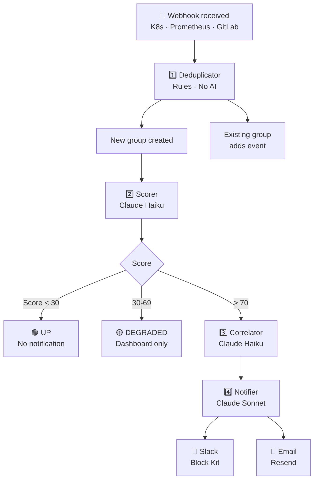

# AI Pipeline

centinelAI uses a 4-agent pipeline built on Inngest
(durable step functions) and Claude AI by Anthropic.

## Full flow



## Agents

| Agent | Model | Time | Function |
|-------|-------|------|----------|
| [Deduplicator](deduplicator.md) | Rules | ~100ms | Groups similar events |
| [Scorer](scorer.md) | Claude Haiku | ~2s | Scores 0-100 |
| [Correlator](correlator.md) | Claude Haiku | ~2s | Finds patterns |
| [Notifier](notifier.md) | Claude Sonnet | ~5s | Generates notification |
| [Postmortem](postmortem.md) | Claude Sonnet | ~10s | Post-incident analysis |

## Inngest events

```
centinelai/alert.received    → Deduplicator
centinelai/group.created     → Scorer
centinelai/group.scored      → Correlator
centinelai/group.critical    → Notifier (only if score > 70)
```
