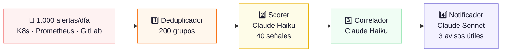

---
hide:
  - navigation
  - toc
---

## De 1.000 alertas al día a 3 interrupciones que importan. { .hero-title }

centinelAI absorbe todo el ruido de tu infraestructura con IA,
filtra el 99% automáticamente y solo avisa cuando hay algo crítico.
**Sin cambiar tu stack. Sin agentes complejos.**

[Empezar en 10 minutos →](getting-started/quick-start.md){ .md-button .md-button--primary }
[Ver conectores](connectors/index.md){ .md-button }

---

## ¿Cómo funciona?

-   :material-download-network:{ .lg .middle } **1. Recibe todas las alertas**

    ---

    Webhooks desde Kubernetes, Prometheus, Grafana y GitLab.
    Un agente Python ligero en tu cluster. Instalación en **10 minutos**.

    [:octicons-arrow-right-24: Ver conectores](connectors/index.md)

-   :material-brain:{ .lg .middle } **2. IA lo filtra todo**

    ---

    4 agentes con **Claude AI** evalúan cada alerta en contexto.
    Score de 0 a 100 con explicación en lenguaje natural.

    [:octicons-arrow-right-24: Pipeline de IA](ai-pipeline/index.md)

-   :material-bell-check:{ .lg .middle } **3. Solo interrumpe cuando importa**

    ---

    Solo **score >70** llega a tu equipo. Con causa probable,
    impacto estimado y acciones recomendadas.

    [:octicons-arrow-right-24: Ver notificador](ai-pipeline/notifier.md)

-   :material-file-document-edit:{ .lg .middle } **4. Postmortem automático**

    ---

    Al resolver un incidente, **Claude Sonnet** genera el postmortem
    completo con timeline, causa raíz y acciones preventivas.

    [:octicons-arrow-right-24: Ver postmortem](ai-pipeline/postmortem.md)

---

## Pipeline de 4 agentes IA

---

## Conectores disponibles

-   :simple-kubernetes: **Kubernetes**

    **✅ Disponible** · Setup ~2 min

    Agente Python con RBAC read-only. Detecta CrashLoops, OOMKills,
    ImagePullBackOff y más en tiempo real.

    [:octicons-arrow-right-24: Configurar](connectors/kubernetes.md)

-   :simple-prometheus: **Prometheus / Grafana**

    **✅ Disponible** · Setup ~5 min

    Compatible con Alertmanager y Grafana Alerting.
    Zero-config con tu stack existente.

    [:octicons-arrow-right-24: Configurar](connectors/prometheus.md)

-   :simple-gitlab: **GitLab CI/CD**

    **✅ Disponible** · Setup ~3 min

    Pipeline events y job failures. Correlación automática
    con eventos de Kubernetes.

    [:octicons-arrow-right-24: Configurar](connectors/gitlab.md)

-   :simple-slack: **Slack**

    **✅ Disponible** · Setup ~2 min

    Notificaciones ricas con botones de acción. Declara incidentes
    y silencia alertas sin salir de Slack.

    [:octicons-arrow-right-24: Configurar](connectors/slack.md)

---

## Planes

| | **Starter** | **Team** | **Pro** |
|--|:-----------:|:--------:|:-------:|
| Precio | **0€/mes** | **249€/mes** | **499€/mes** |
| Servicios | 3 | 25 | Ilimitados |
| Score con Claude AI | ❌ | ✅ | ✅ |
| Slack + Email | ❌ | ✅ | ✅ |
| Postmortem IA | ❌ | ✅ | ✅ |

!!! success "ROI inmediato"
    Un incidente de 2h con 10 ingenieros = **4.000€**.
    centinelAI Team = **249€/mes**. Previniendo 1 incidente al mes → **ROI 1.507%**.

[Crear cuenta gratis](https://centinelai.io/register){ .md-button .md-button--primary }
[Ver todos los planes](plans/index.md){ .md-button }
